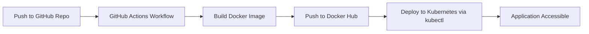

```
minikube start --driver=docker \
  --ports=80:80 \
  --ports=3000:3000 \
  --ports=31568:31568
````

```
http://<your-server-ip>:31568/
```

# 🚀 DevOps CI/CD Project — Automatic Docker Build & Kubernetes Deployment

👋 Hello, I'm **Himanshu Parashar**

This project demonstrates a complete CI/CD pipeline using **GitHub Actions**, where every code push automatically:

- Builds a Docker image
- Pushes it to Docker Hub
- Deploys it to a Kubernetes cluster (Minikube)

---

## 🏗 Tech Stack Used

| Component | Tool |
|----------|------|
| CI/CD Pipeline | GitHub Actions |
| Containerization | Docker |
| Container Registry | Docker Hub |
| Kubernetes Deployment | Minikube (Self-Hosted Runner) |
| Hosting | Kubernetes NodePort |

---

## 🔄 CI/CD Flow



---

## 🧩 Kubernetes Deployment

### 📌 Deployment (`deployment.yaml`)
```yaml
apiVersion: apps/v1
kind: Deployment
metadata:
  name: hello-app
spec:
  replicas: 1
  selector:
    matchLabels:
      app: hello-app
  template:
    metadata:
      labels:
        app: hello-app
    spec:
      containers:
        - name: hello-container
          image: himanshu085/hello-k8s:latest
          ports:
            - containerPort: 3000
```

### 📌 Service (`service.yaml`)
```yaml
apiVersion: v1
kind: Service
metadata:
  name: hello-service
spec:
  type: NodePort
  selector:
    app: hello-app
  ports:
    - port: 3000
      targetPort: 3000
      nodePort: 31568
```

---

## 🧪 GitHub Actions Workflow (`deploy.yml`)
✔ Runs on self-hosted runner  
✔ Builds Docker image  
✔ Pushes to Docker Hub  
✔ Applies Kubernetes manifests automatically

---

## 🌐 Application Access

After deployment, the application becomes reachable using:

```
http://<your-server-ip>:31568/
```

Example (your case):

```
http://192.168.8.167:31568/
```

Expected output displayed in browser:

```
Hello, I'm Himanshu 👋 — Deployed on Kubernetes via GitHub Actions 🚀
```

---

## 🤝 What I Learned

✔ CI/CD workflow orchestration with GitHub Actions  
✔ Docker build & registry integration  
✔ Kubernetes Deployment & Service configuration  
✔ Handling Minikube + NodePort networking on a self-hosted runner

---

## 🏁 Future Improvements

| Planned Feature | Status |
|-----------------|--------|
| Add monitoring (Prometheus/Grafana) | ⏳ Planned |
| Ingress instead of NodePort | 🔜 Coming Soon |
| HTTPS with cert-manager | 🔜 Coming Soon |

---

⭐ **If you found this repository helpful, feel free to star it!**
